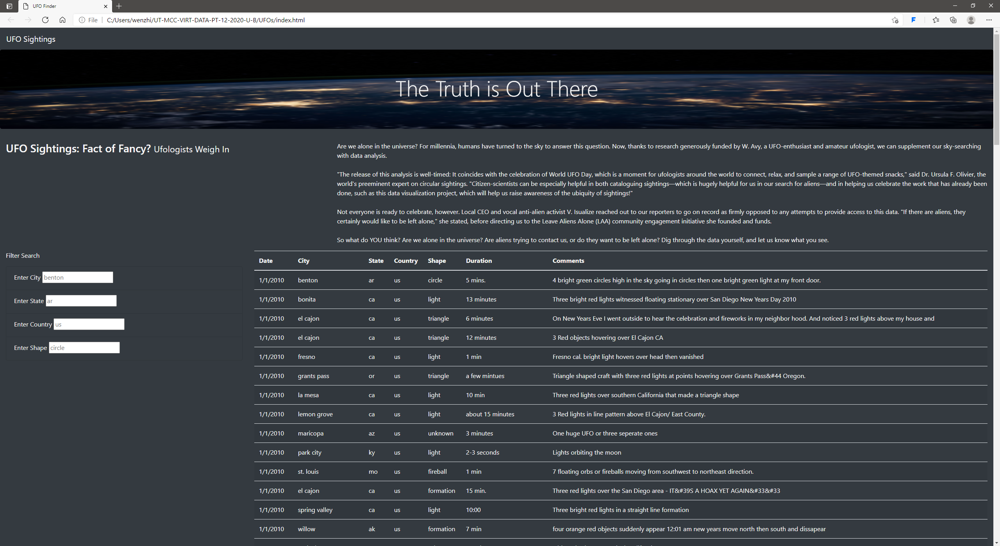
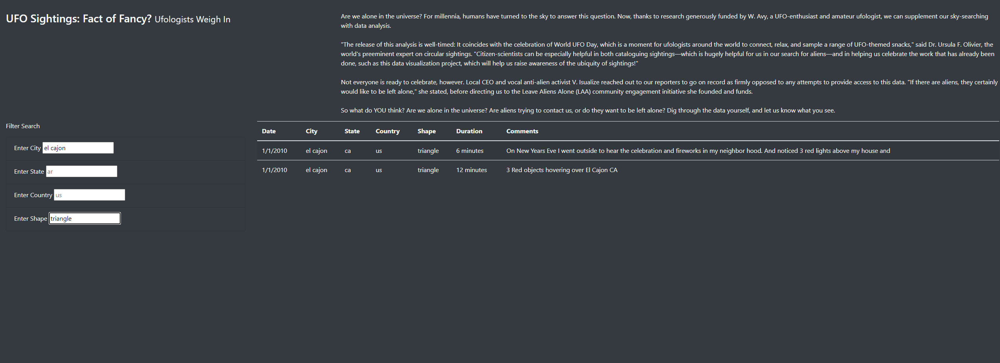

# UFO analysis

## Overview of the analysis
Dana is a data jornalist. She is given an opportunity to write about her hometown, McMinnville Oregon, which is famous for its sightings of UFOs and even has an annual gathering of UFO fans.
So, she chooses the topic of UFOs.
In this project, css, js, html files are used together.
Java script is used to display the UFO data as a table, and a filter is added allowing users to filter for multiple criteria such as city, State, Country and UFO shape.
Css file is used to insert a background picture and define styles(color,text format).
Fnally, A webpage is created to show the UFO sighting events and provides the functionality of filtering.

## Results

The html looks like below:

On the left of the webpage, there are four filters.
just enter the key words and hit enter to use filters. 
For example, find event in city "el cajon" and shape "triangle": 

## Summary
### Drawback
The filter is case sensitive and cannot apply partially search. For example, if we search "Triangle" or "tri", it does not give any result.

### Possible Further improvement
 - providing hyperlink for each event, which includes more details and some pictures
 - showing the total amount of sighting events 
